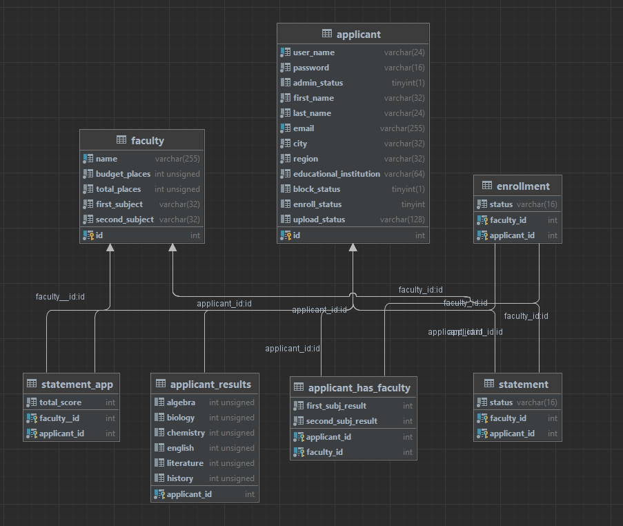
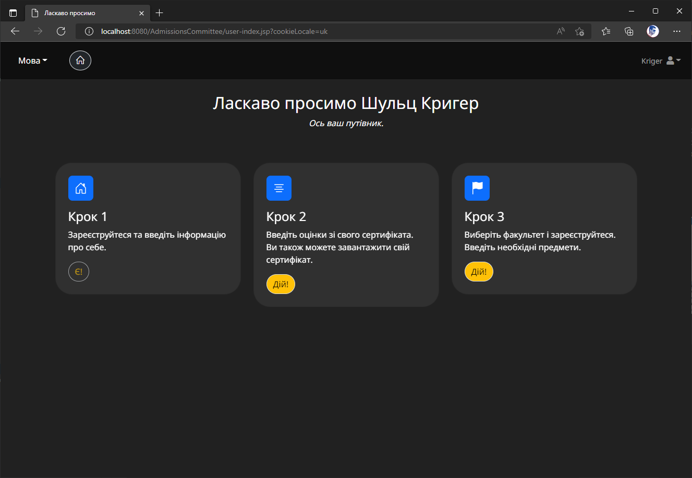

# ADMISSIONS COMMITTEE PROJECT

The system has a list of faculties for which it is necessary to implement the possibility of sorting:
* `by name` (a-z, z-a);
* `by the number of budget places`;
* `by the total number of places`.

The applicant registers in the system. During registration, it is necessary to enter the `name`, `email`, `city`, 
`region`, `FULL name of the educational institution` (*optional*: `attach a scan of the certificate with grades`). 
The entrant can register for one or more faculties. When registering for the faculty, the student enters 
the results of the relevant subjects, as well as grades from the certificate.

The `system administrator` has the rights:
* adding, deleting, or editing faculty;
* blocking or unblocking the applicant;
* adding applicants' results to the Statement;
* finalization the Statement for enrollment.

After finalizing the Statement, the system calculates the amount of points and determines the applicants 
enrolled in the educational institution for budget places and on the contract. (If you wish you can add a 
notification about the result of enrollment in a certain form of education, as well as not enrollment by 
sending an email to the applicant).

## Entities Class diagram

### Screenshots

